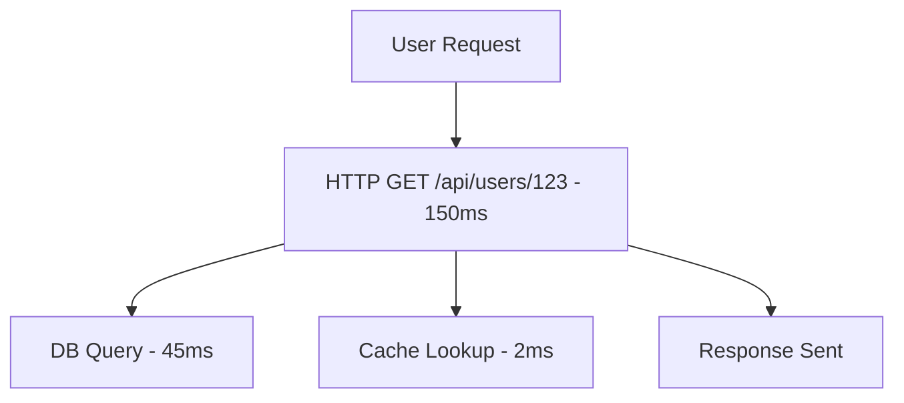
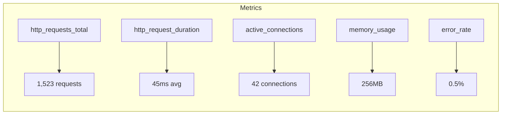
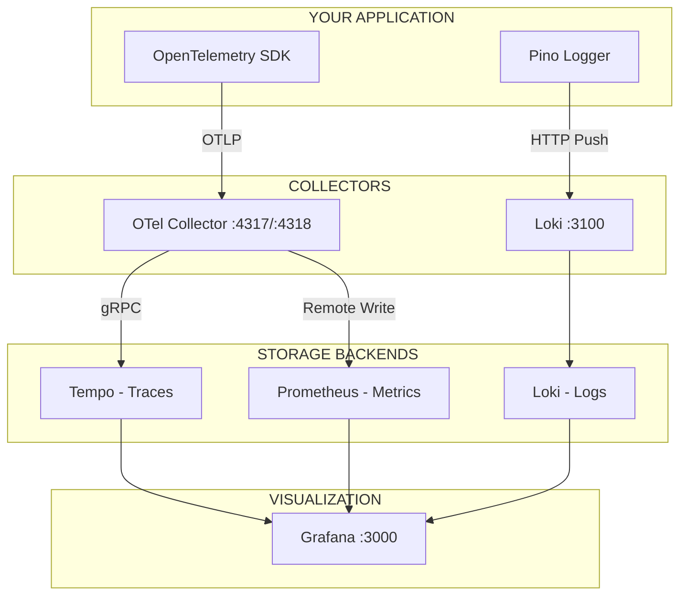
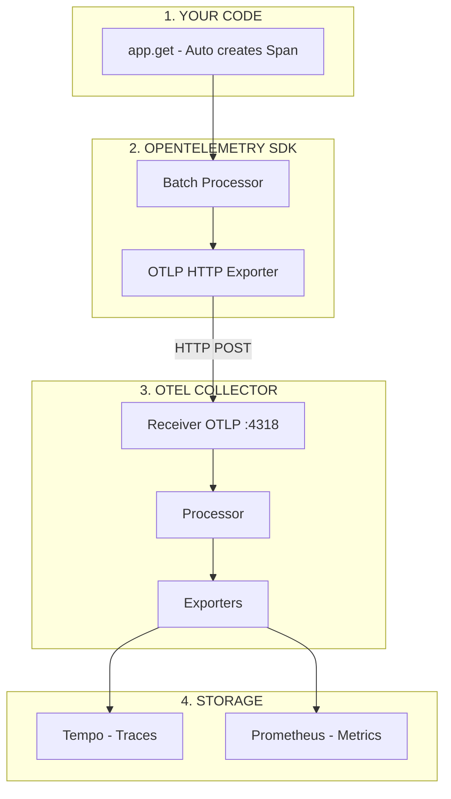
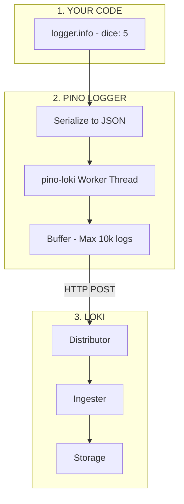
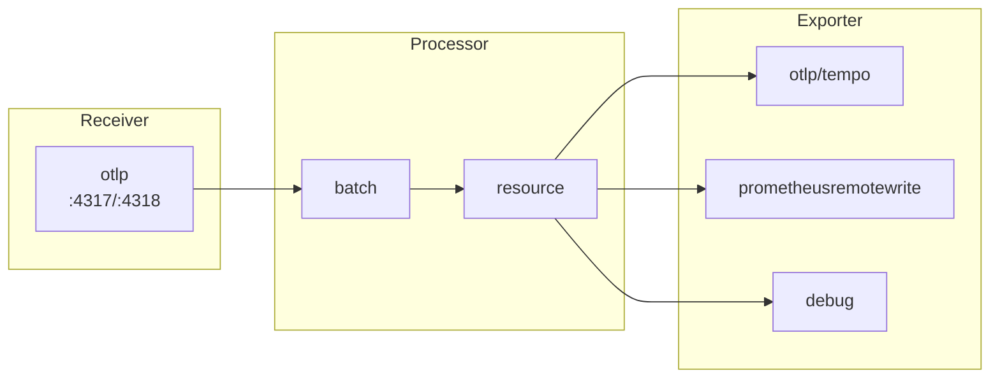
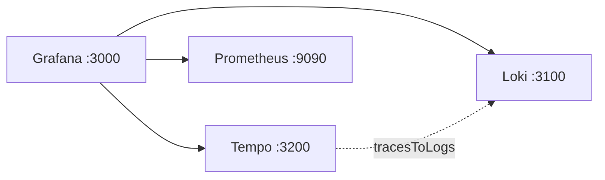

# OpenTelemetry Observability Stack 🔭

A complete, production-ready observability stack for learning OpenTelemetry with Node.js. This project demonstrates how to collect **traces**, **metrics**, and **logs** using the CNCF's OpenTelemetry standard.

> **"Observability is the ability to understand the internal state of a system by examining its external outputs."**
> — [OpenTelemetry Documentation](https://opentelemetry.io/docs/concepts/observability-primer/)

---

## 📑 Table of Contents

- [What is Observability?](#what-is-observability)
- [The Three Pillars of Observability](#the-three-pillars-of-observability)
  - [Traces](#1-traces-)
  - [Metrics](#2-metrics-)
  - [Logs](#3-logs-)
- [Architecture Overview](#architecture-overview)
- [Quick Start](#quick-start)
- [How Data Flows](#how-data-flows)
  - [Traces & Metrics Flow](#traces--metrics-flow)
  - [Logs Flow](#logs-flow)
- [Configuration Files Explained](#configuration-files-explained)
  - [docker-compose.yml](#docker-composeyml)
  - [otel-collector.yaml](#otel-collectoryaml)
  - [tempo.yaml](#tempoyaml)
  - [loki.yaml](#lokiyaml)
  - [prometheus.yaml](#prometheusyaml)
  - [grafana-datasources.yaml](#grafana-datasourcesyaml)
  - [alloy.alloy](#alloyalloy)
- [Key Concepts](#key-concepts)
- [Port Reference](#port-reference)
- [Further Reading](#further-reading)

---

## What is Observability?

Observability lets you understand **what's happening inside your application** without modifying its code (much). It answers questions like:

- Why is this request slow?
- Where did this error come from?
- How many requests are we handling per second?
- What was the user doing when the bug occurred?

OpenTelemetry (OTel) is the **industry standard** for collecting observability data. It's:

- **Vendor-neutral**: Works with any backend (Jaeger, Datadog, New Relic, etc.)
- **CNCF project**: Same foundation as Kubernetes
- **Unified**: One SDK for traces, metrics, and logs

> 📖 **Official Definition**: _"OpenTelemetry is a collection of APIs, SDKs, and tools to instrument, generate, collect, and export telemetry data (metrics, logs, and traces)."_
> — [opentelemetry.io](https://opentelemetry.io/docs/what-is-opentelemetry/)

---

## The Three Pillars of Observability

### 1. Traces 🔍

A **trace** represents the complete journey of a request through your system.



**Key Concepts:**

| Term                    | Description                                                      |
| ----------------------- | ---------------------------------------------------------------- |
| **Trace**               | The entire request journey, composed of spans                    |
| **Span**                | A single operation within a trace (e.g., HTTP request, DB query) |
| **Trace ID**            | Unique identifier linking all spans in one trace                 |
| **Parent Span**         | The span that initiated a child operation                        |
| **Context Propagation** | Passing trace IDs across service boundaries                      |

> 📖 _"A trace is made up of one or more spans. The first span represents the root span. Each root span represents a request from start to finish."_
> — [OpenTelemetry Traces Documentation](https://opentelemetry.io/docs/concepts/signals/traces/)

---

### 2. Metrics 📊

**Metrics** are numerical measurements collected over time. They answer: _"How is my system performing right now?"_



**Types of Metrics:**

| Type          | Description            | Example                   |
| ------------- | ---------------------- | ------------------------- |
| **Counter**   | Only goes up           | Total requests, errors    |
| **Gauge**     | Can go up and down     | Memory usage, temperature |
| **Histogram** | Distribution of values | Request duration buckets  |

> 📖 _"Metrics are aggregations over a period of time of numeric data about your infrastructure or application."_
> — [OpenTelemetry Metrics Documentation](https://opentelemetry.io/docs/concepts/signals/metrics/)

---

### 3. Logs 📝

**Logs** are timestamped text records of discrete events.

```
2024-01-17T10:30:45.123Z INFO  [otel-poc-app] Request started   {method: "GET", path: "/rolldice"}
2024-01-17T10:30:45.125Z INFO  [otel-poc-app] Dice rolled       {dice: 5}
2024-01-17T10:30:45.126Z INFO  [otel-poc-app] Response sent     {status: 200, duration: 3ms}
```

**What makes logs powerful with OpenTelemetry:**

- **Trace Correlation**: Each log can include the `trace_id` so you can jump from a log to its trace
- **Structured Data**: JSON format with searchable fields
- **Centralized**: All services send logs to one place (Loki)

> 📖 _"A log is a timestamped text record, either structured (recommended) or unstructured, with optional metadata."_
> — [OpenTelemetry Logs Documentation](https://opentelemetry.io/docs/concepts/signals/logs/)

---

## Architecture Overview



---

## Quick Start

### Prerequisites

- Docker & Docker Compose
- Node.js 18+
- pnpm (or npm)

### 1. Start the Observability Stack

```bash
docker compose up -d
```

### 2. Install Dependencies

```bash
pnpm install
```

### 3. Run the Application

```bash
pnpm start
```

### 4. Generate Some Telemetry

```bash
# Make some requests
curl http://localhost:8080/rolldice
curl http://localhost:8080/process
```

### 5. View in Grafana

Open [http://localhost:3000](http://localhost:3000) and explore:

- **Tempo**: View traces
- **Loki**: Query logs
- **Prometheus**: Check metrics

---

## How Data Flows

### Traces & Metrics Flow

The journey from your code to storage:



> 📖 _"The Collector receives telemetry data, processes it, and exports it to the configured backend(s)."_
> — [OTel Collector Documentation](https://opentelemetry.io/docs/collector/)

---

### Logs Flow

Logs take a different path using **pino-loki**:



---

## Configuration Files Explained

### docker-compose.yml

**Purpose:** Orchestrates all containers in the observability stack.

📂 [View File](./docker-compose.yml)

```yaml
services:
  otel-collector:
    image: otel/opentelemetry-collector-contrib:latest
    ports:
      - "4317:4317" # gRPC - binary protocol, faster
      - "4318:4318" # HTTP - simpler, easier to debug
```

**Key Concepts:**

| Field        | Description                                                    |
| ------------ | -------------------------------------------------------------- |
| `image`      | Docker image to use from Docker Hub                            |
| `ports`      | Format: `host:container` - maps container port to your machine |
| `volumes`    | Mount local files into the container                           |
| `depends_on` | Start this service only after dependencies are running         |

> 📖 Learn more: [Docker Compose Documentation](https://docs.docker.com/compose/)

---

### otel-collector.yaml

**Purpose:** Central hub that receives, processes, and exports telemetry data.

📂 [View File](./observability/otel-collector.yaml)



The collector has three main sections:

```yaml
# RECEIVERS - How data comes IN
receivers:
  otlp:
    protocols:
      grpc:
        endpoint: 0.0.0.0:4317
      http:
        endpoint: 0.0.0.0:4318

# PROCESSORS - Transform data in the middle
processors:
  batch:
    timeout: 1s
    send_batch_size: 1024

# EXPORTERS - Where data goes OUT
exporters:
  otlp/tempo:
    endpoint: tempo:4317

# SERVICE - Wire everything together
service:
  pipelines:
    traces:
      receivers: [otlp]
      processors: [batch]
      exporters: [otlp/tempo]
```

> 📖 _"The OpenTelemetry Collector offers a vendor-agnostic implementation of how to receive, process and export telemetry data."_
> — [OTel Collector Documentation](https://opentelemetry.io/docs/collector/)

---

### tempo.yaml

**Purpose:** Configure Grafana Tempo for trace storage.

📂 [View File](./observability/tempo.yaml)

```yaml
server:
  http_listen_port: 3200 # Grafana connects here

distributor:
  receivers:
    otlp:
      protocols:
        grpc:
          endpoint: 0.0.0.0:4317 # Collector sends traces here

storage:
  trace:
    backend: local # Store locally (not S3/GCS)
    local:
      path: /tmp/tempo/blocks # Where traces are saved

compactor:
  compaction:
    block_retention: 1h # Delete traces after 1 hour
```

> 📖 Learn more: [Grafana Tempo Documentation](https://grafana.com/docs/tempo/latest/)

---

### loki.yaml

**Purpose:** Configure Grafana Loki for log storage.

📂 [View File](./observability/loki.yaml)

```yaml
auth_enabled: false # No authentication (dev mode)

server:
  http_listen_port: 3100 # App sends logs here, Grafana queries here

limits_config:
  allow_structured_metadata: true # Enable rich metadata in logs
  otlp_config:
    resource_attributes:
      attributes_config:
        - action: index_label # Make these searchable
          attributes:
            - service.name # Index by service name

schema_config:
  configs:
    - from: 2020-10-24
      store: tsdb # Time-series database format
      schema: v13 # Latest schema version
```

> 📖 Learn more: [Grafana Loki Documentation](https://grafana.com/docs/loki/latest/)

---

### prometheus.yaml

**Purpose:** Configure Prometheus for metrics storage.

📂 [View File](./observability/prometheus.yaml)

```yaml
global:
  scrape_interval: 15s # How often to pull metrics

scrape_configs:
  - job_name: "prometheus"
    static_configs:
      - targets: ["localhost:9090"] # Prometheus scrapes itself
```

**Note:** In this setup, the OTel Collector **pushes** metrics to Prometheus using `prometheusremotewrite`, so scrape configs are minimal.

> 📖 Learn more: [Prometheus Documentation](https://prometheus.io/docs/)

---

### grafana-datasources.yaml

**Purpose:** Pre-configure Grafana data sources.

📂 [View File](./observability/grafana-datasources.yaml)



```yaml
apiVersion: 1

datasources:
  - name: Tempo
    type: tempo
    url: http://tempo:3200
    isDefault: true
    jsonData:
      tracesToLogs: # Jump from trace to logs!
        datasourceUid: loki
        tags: ["service.name"]

  - name: Loki
    type: loki
    url: http://loki:3100
    uid: loki

  - name: Prometheus
    type: prometheus
    url: http://prometheus:9090
```

> 📖 Learn more: [Grafana Provisioning](https://grafana.com/docs/grafana/latest/administration/provisioning/)

---

### alloy.alloy

**Purpose:** Grafana's observability agent for collecting logs (alternative to OTel for logs).

📂 [View File](./observability/alloy.alloy)

```alloy
// Where to send logs
loki.write "default" {
  endpoint {
    url = "http://loki:3100/loki/api/v1/push"
  }
}

// HTTP receiver for logs
loki.source.api "push_receiver" {
  http {
    listen_address = "0.0.0.0"
    listen_port    = 3500
  }
  forward_to = [loki.process.add_labels.receiver]
}

// Add labels to logs
loki.process "add_labels" {
  forward_to = [loki.write.default.receiver]

  stage.static_labels {
    values = {
      env = "development",
    }
  }
}
```

> 📖 Learn more: [Grafana Alloy Documentation](https://grafana.com/docs/alloy/latest/)

---

## Key Concepts

| Concept                 | Description                              | Documentation                                                                 |
| ----------------------- | ---------------------------------------- | ----------------------------------------------------------------------------- |
| **OTLP**                | OpenTelemetry Protocol - standard format | [OTLP Specification](https://opentelemetry.io/docs/specs/otlp/)               |
| **gRPC**                | Binary protocol, faster than HTTP        | [gRPC](https://grpc.io/)                                                      |
| **Context Propagation** | Passing trace IDs across services        | [Context](https://opentelemetry.io/docs/concepts/context-propagation/)        |
| **Instrumentation**     | Adding observability to your code        | [Instrumentation](https://opentelemetry.io/docs/concepts/instrumentation/)    |
| **Exporter**            | Sends telemetry to backends              | [Exporters](https://opentelemetry.io/docs/concepts/components/#exporters)     |
| **Receiver**            | Accepts incoming telemetry               | [Receivers](https://opentelemetry.io/docs/collector/configuration/#receivers) |
| **Pipeline**            | Receiver → Processor → Exporter chain    | [Pipelines](https://opentelemetry.io/docs/collector/configuration/#service)   |

---

## Port Reference

| Port | Service        | Purpose                                                 |
| ---- | -------------- | ------------------------------------------------------- |
| 3000 | Grafana        | Web UI - [http://localhost:3000](http://localhost:3000) |
| 3100 | Loki           | Log ingestion & query API                               |
| 3200 | Tempo          | Trace query API                                         |
| 3500 | Alloy          | HTTP log receiver (optional)                            |
| 4317 | OTel Collector | OTLP gRPC receiver                                      |
| 4318 | OTel Collector | OTLP HTTP receiver                                      |
| 8080 | Your App       | Express server                                          |
| 9090 | Prometheus     | Metrics API & UI                                        |

---

## Further Reading

### OpenTelemetry

- 📖 [OpenTelemetry Documentation](https://opentelemetry.io/docs/)
- 📖 [OpenTelemetry JavaScript SDK](https://opentelemetry.io/docs/languages/js/)
- 📖 [OpenTelemetry Collector](https://opentelemetry.io/docs/collector/)
- 📖 [OTLP Specification](https://opentelemetry.io/docs/specs/otlp/)

### Grafana Stack

- 📖 [Grafana Documentation](https://grafana.com/docs/grafana/latest/)
- 📖 [Tempo Documentation](https://grafana.com/docs/tempo/latest/)
- 📖 [Loki Documentation](https://grafana.com/docs/loki/latest/)
- 📖 [Alloy Documentation](https://grafana.com/docs/alloy/latest/)

### Other

- 📖 [Prometheus Documentation](https://prometheus.io/docs/)
- 📖 [Pino Logger](https://getpino.io/)
- 📖 [Docker Compose](https://docs.docker.com/compose/)

---

## License

MIT

---

<p align="center">
  Made with 🔭 for learning OpenTelemetry
</p>
